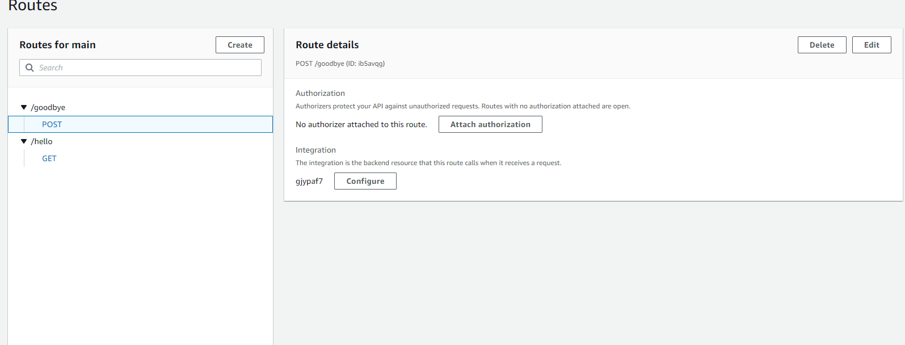

# Terraform
Week 7 of Applaudo Studios DevOps Program

## Description
- This repository contains the terraform code to deploy to lambdas within a single API Gateway.
- The HTTP requests are handled by the lambda functions. The lambda functions are written in javascript.
1. The first lambda function is called `hello` and it returns a JSON object with a message. 
It also accepts a query parameter called `name` and returns a personalized message.
The lambda function is connected to the API Gateway using the `GET` method.

2. The second lambda function is called `goodbye` and it returns a JSON object with a message.
It also accepts a query parameter called `name` and returns a personalized message.
The lambda function is connected to the API Gateway using the `POST` method.

- Finally, the functions are monitored by CloudWatch.
- You can execute the lambdas by using an API client like Postman. 
It is only necessary to select the right method and the url given by the outputs. 

- The lambdas are connected to a single API Gateway.

## Requirements
- Terraform
- AWS account
- AWS CLI
- AWS credentials configured using a IAM Role

## Usage
- Clone the repository
- Configure your AWS credentials using the `aws configure` command
- Run `terraform init` inside the `terraform` folder to initialize the project
- Run `terraform plan` to see the changes that will be applied
- Run `terraform apply` to apply the changes
- Once you are done with the project, run `terraform destroy` to delete the resources